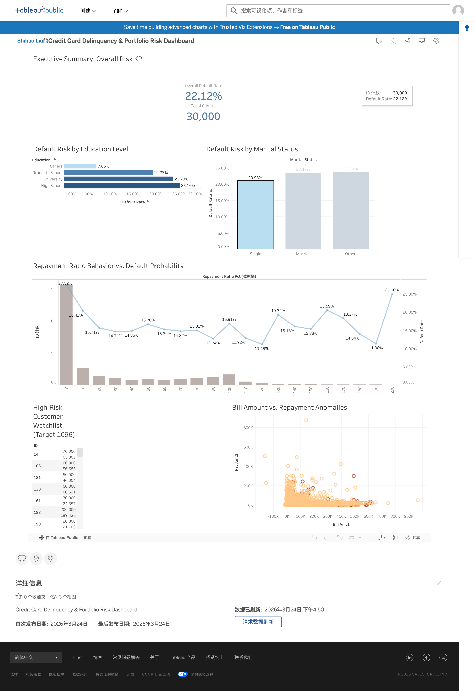

# Credit Card Default Risk & Portfolio Analytics

## 📌 Project Overview

[🔗 Click here to view the Interactive Tableau Dashboard]([https://public.tableau.com/app/profile/shihao.liu2065/viz/CreditCardDelinquencyPortfolioRiskDashboard/CreditCardDelinquencyPortfolioRiskDashboard#1])
This project focuses on identifying high-risk credit card holders and analyzing default patterns using a dataset of 30,000 clients. By leveraging **SQL** for data engineering and **Tableau** for business intelligence, I transformed raw transaction data into an actionable risk management dashboard.

## 🛠️ Tech Stack
* **Data Engineering:** MySQL (Data Cleaning, Label Encoding, Feature Engineering)
* **Business Intelligence:** Tableau Public (Dual-Axis Charts, Data Bins, Interactive Filtering)

## 💡 Key Business Insights
* **Risk Concentration:** Identified that **High School** graduates and **Married** individuals exhibit higher default rates compared to other demographic segments.
* **Repayment Behavior:** Engineered a **"Repayment Ratio"** metric. Analysis revealed that clients with a ratio <10% have a **27.52%** default probability, nearly 5% higher than the portfolio average.
* **Data Integrity:** Detected and filtered over 600 extreme outliers (repayment ratios >200%) to ensure the accuracy of the risk distribution model.

## 📊 Actionable Deliverables
* **Executive Dashboard:** A comprehensive BI tool for risk managers to monitor portfolio health in real-time.
* **High-Risk Watchlist:** A prioritized list of **1,096 high-risk clients** based on credit utilization and delinquency history for the collections team.

